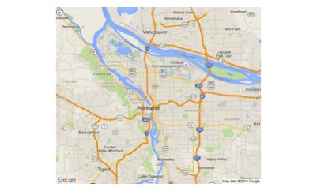
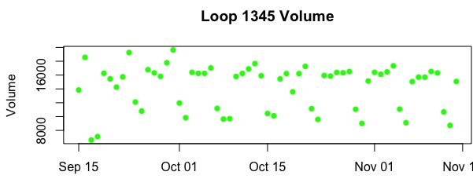
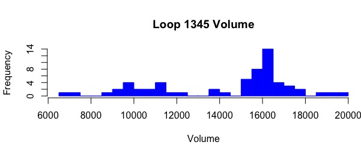
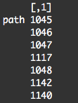

```{r setup, include=FALSE}
knitr::opts_chunk$set(echo = TRUE)
```

## Introduction

The Freeway Dataset is for the Federal Highway Administration (FHWA) Test Data Set project submission.    

The Portland data environment provides the following data:

  (a) Freeway data consisting of two months of data from dual-loop detectors deployed in the main line and on-ramps of a Portland-area freeway (I-205) 
  (b) Incident data from the Oregon Department of Transportation Advanced Traffic Management System database and planned event data from the ODOT Trip-Check Traveler Information Portal information web site
  (c) Weather data from two sources: NOAA data and Remote Weather Information System (RWIS) station data
  (d) Three types of arterial data:
      (1) Volume and occupancy data from four single loop detectors on 82nd Ave
      (2) Signal phase and timing data for 32 signals along the 82nd Avenue corridor
      (3) Travel times on 82nd Ave., computed from data collected by two Bluetooth readers
  (e) Transit data provided from TriMet, the Portland-metro area transit agency, including schedule, stop event and passenger counts data for both bus and light rail [1]



```{r map, echo=FALSE, eval=FALSE}
PDX_map<-gmap("Portland OR", type="roadmap")
plot(PDX_map, interpolate=TRUE)
```

The data collection period for all datasets is Sept. 15, 2011 through Nov. 15, 2011.


\n


## Datasets and Subsets

The main **datasets** that used in this project are:
   
   (1) __loops:__ it contains 20-second speed, occupancy, volume and data quality flags for the freeway data
   
   (2) __detectors:__ it contains the detectors' metadata
   
   (3) __stations:__ it contains stations' metadata
   
   (4) __highways:__ it contains highways' metadata in the Portland-Vancouver metropolitan region; it focuses on I-205 NB and SB
   
  
```{r datasets, echo=FALSE, eval=FALSE}
detectors<-read.csv("freeway_detectors.csv")
loops<-read.csv("freeway_loopdata.csv")
stations<-read.csv("freeway_stations.csv")
highways<-read.csv("highways.csv")
```


These four datasets were used to create new **subsets** that needed to perform different operations on the loops:
   
   (1) __detectors.N:__ It contains the detectors that located in the North side
   
   (2) __detectors.S:__ It contains the detectors that located in the South side
   
   (3) __stations.N:__ It contains the stations that located in the North side
   
   (4) __stations.S:__ It contains the stations that located in the South side
   
   (5) __loops.sub:__ It contains the detectorid, starttime, volme, and speed columns from loops dataset
   
   (6) __loop.1345, loop.1346, loop.1347, loop.1348, and loop.1350:__ each contains specific loop's starttime, volume, and speed data 
   

```{r subsets, echo=FALSE, eval=FALSE}
#detectors-North
detectors.N<- subset(detectors, highwayid==3, select = c(-detectorclass))

#detectors-South
detectors.S<- subset(detectors, highwayid==4, select = c(-detectorclass))

#stations-North
stations.N<- subset(stations, highwayid==3, select = c(stationid, highwayid, milepost, locationtext, downstream))

#station-South
stations.S<- subset(stations, highwayid==4, select = c(stationid, highwayid, milepost, locationtext, downstream))

#New loops subset
loops.sub<- subset(loops,speed>=0 & volume>=0,select=c(detectorid,starttime,volume,speed))

#loopdata based on detectorid
loop.1345 <-subset(loops, detectorid == 1345, select = c(starttime, volume, speed))
loop.1346 <-subset(loops, detectorid == 1346, select = c(starttime, volume, speed))
loop.1347 <-subset(loops, detectorid == 1347, select = c(starttime, volume, speed))
loop.1348 <-subset(loops, detectorid == 1348, select = c(starttime, volume, speed))
loop.1350 <-subset(loops, detectorid == 1350, select = c(starttime, volume, speed))
#to change NA to 0
loop.1345[is.na(loop.1345)]<-0
loop.1346[is.na(loop.1346)]<-0
loop.1347[is.na(loop.1347)]<-0
loop.1348[is.na(loop.1348)]<-0
loop.1350[is.na(loop.1350)]<-0
######### JOIN #########
loops.detectors.join <- full_join(loops.sub, detectors, by="detectorid")

loops.detectors <- subset(loops.detectors.join, select=c(detectorid, starttime, locationtext, volume, speed))

#table1: this table extracts some columns from loops.joins and summorize th volume by date
loops.volume<-aggregate(loops.detectors$volume,by=list(loops.detectors$detectorid, as.POSIXct(loops.detectors$starttime, format="%m/%d/%y %H"), loops.detectors$locationtext),sum)
names(loops.volume)[1]<-"detectorid"
names(loops.volume)[2]<-"starttime"
names(loops.volume)[3]<-"locationtext"
names(loops.volume)[4]<-"volume"

#table2: this table is used to store an intermediate result
#it splits the "starttime" column in loops.volume into two columns (date and time)
loops.volume.intermed<-aggregate(loops.volume$volume,by=list(as.Date(loops.volume$starttime, format="%m/%d/%y"), strftime(loops.volume$starttime, format="%H"), loops.volume$detectorid, loops.volume$locationtext),sum)
names(loops.volume.intermed)[1]<-"date"
names(loops.volume.intermed)[2]<-"time"
names(loops.volume.intermed)[3]<-"detectorid"
names(loops.volume.intermed)[4]<-"locationtext"
names(loops.volume.intermed)[5]<-"volume"

#table3: This table is used to store the final result
#The mean/avg between 7:00 am and 9:00 am
loops.79am.volume.avg <- loops.volume.intermed %>% filter(as.numeric(loops.volume.intermed$time) > 06 & as.numeric(loops.volume.intermed$time) < 10 ) %>% select(date, time, detectorid, locationtext, volume) %>%  group_by(date, detectorid, locationtext)  %>%  summarize(Avg.volume=mean(volume)) %>% arrange(date)
names(loops.79am.volume.avg)[1]<-"date"
names(loops.79am.volume.avg)[2]<-"detectorid"
names(loops.79am.volume.avg)[3]<-"locationtext"
names(loops.79am.volume.avg)[4]<-"Avg.volume"

#table4: This table is used to store the final result
#The mean/avg between 4:00 pm and 6:00 pm
loops.46pm.volume.avg <- loops.volume.intermed %>% filter(as.numeric(loops.volume.intermed$time) > 15 & as.numeric(loops.volume.intermed$time) < 19 ) %>% select(date, time, detectorid, locationtext, volume) %>%  group_by(date, detectorid, locationtext)  %>%  summarize(Avg.volume=mean(volume)) %>% arrange(date)
names(loops.46pm.volume.avg)[1]<-"date"
names(loops.46pm.volume.avg)[2]<-"detectorid"
names(loops.46pm.volume.avg)[3]<-"locationtext"
names(loops.46pm.volume.avg)[4]<-"Avg.volume"

######### JOIN #########
#########
#In the following three tables, we are computing the Peak Period volume 
#for detector 1345 which is loacted in Sunnyside NB
# in two periods 7:00 am - 9:00 am AND for 4:00 pm - 6:00 pm 

#table1: this table extracts some columns from loop1345 and summorize th volume by date 
loop1345.volume<-aggregate(loop.1345$volume,by=list(as.POSIXct(loop.1345$starttime, format="%m/%d/%y %H")),sum)
names(loop1345.volume)[1]<-"starttime"
names(loop1345.volume)[2]<-"volume"

#table2: this table is used to store an intermediate result
#it splits the "starttime" column in loop1345.volume into two columns (date and time)
loop1345.intermed<-aggregate(loop1345.volume$volume,by=list(as.Date(loop1345.volume$starttime, format="%m/%d/%y"), strftime(loop1345.volume$starttime, format="%H")),sum)
names(loop1345.intermed)[1]<-"date"
names(loop1345.intermed)[2]<-"time"
names(loop1345.intermed)[3]<-"volume"

#table3: This table is used to store the final result
#The mean/avg between 7:00 am and 9:00 am
loop1345.79am.volume.avg <- loop1345.intermed %>% filter(as.numeric(loop1345.intermed$time) > 06 & as.numeric(loop1345.intermed$time) < 10 ) %>% select(date, time, volume) %>%  group_by(date)  %>%  summarize(Avg.volume=mean(volume)) %>% arrange(date)
names(loop1345.79am.volume.avg)[1]<-"date"
names(loop1345.79am.volume.avg)[2]<-"avg"

#table4: This table is used to store the final result
#The mean/avg between 4:00 pm and 6:00 pm
loop1345.46pm.volume.avg <- loop1345.intermed %>% filter(as.numeric(loop1345.intermed$time) > 15 & as.numeric(loop1345.intermed$time) < 19 ) %>% select(date, time, volume) %>%  group_by(date)  %>%  summarize(Avg.volume=mean(volume)) %>% arrange(date)
names(loop1345.46pm.volume.avg)[1]<-"date"
names(loop1345.46pm.volume.avg)[2]<-"avg"

#plot
plot(loop1345.79am.volume.avg$date, loop1345.79am.volume.avg$avg, main = "Sunnyside NB-Detector 1345 - 7:00-9:00 am", xlab = "Date", ylab= "Avg(Volume)", col="blue")
plot(loop1345.46pm.volume.avg$date, loop1345.46pm.volume.avg$avg, main = "Sunnyside NB-Detector 1345 - 4:00-6:00 pm", xlab = "Date", ylab= "Avg(Volume)", col="blue")
########


#loops volume using sum aggregate
loop1345.volume<-aggregate(loop.1345$volume,by=list(as.POSIXct(loop.1345$starttime, format="%m/%d/%y %H")),sum)
loop1346.volume<-aggregate(loop.1346$volume,by=list(as.POSIXct(loop.1346$starttime, format="%m/%d/%y %H")),sum)
loop1347.volume<-aggregate(loop.1347$volume,by=list(as.POSIXct(loop.1347$starttime, format="%m/%d/%y %H")),sum)
loop1348.volume<-aggregate(loop.1348$volume,by=list(as.POSIXct(loop.1348$starttime, format="%m/%d/%y %H")),sum)
loop1350.volume<-aggregate(loop.1350$volume,by=list(as.POSIXct(loop.1350$starttime, format="%m/%d/%y %H")),sum)

#to rename the attributes
names(loop1345.volume)[1]<-"starttime"
names(loop1346.volume)[1]<-"starttime"
names(loop1347.volume)[1]<-"starttime"
names(loop1348.volume)[1]<-"starttime"
names(loop1350.volume)[1]<-"starttime"
names(loop1350.volume)[2]<-"volume"
names(loop1348.volume)[2]<-"volume"
names(loop1347.volume)[2]<-"volume"
names(loop1346.volume)[2]<-"volume"
names(loop1345.volume)[2]<-"volume"
```


   
## Loops' Volume Summary, Max Speed, and Ave Speed


The loops' _volume summary, maximum speed, and average speed_ computed using subsets that mentioned above. The results can be used to generate different plots and histograms.

__For example:__

This plot shows the volume in loop 1345:





And this histogram represents the frequency of the volume:




```{r aggregates, echo=FALSE, eval=FALSE}
#New subset
loops.sub<- subset(loops,speed>=0 & volume>=0,select=c(detectorid,starttime,volume,speed))

install.packages("dplyr")
install.package("tidyr")

#Loops volume summary
loops.volume.sum <- loops.sub %>% filter(volume>0)  %>% select(detectorid, starttime, volume) %>% group_by(as.Date(starttime, format="%m/%d/%y"), detectorid)  %>% 
summarize(sum_volume=sum(volume)) %>% arrange(detectorid)

names(loops.volume.sum)[1]<-"date"

#loops max speed
loops.max.speed <- loops.sub %>% filter(speed>0)  %>% select(detectorid, starttime, speed) %>% group_by(as.Date(starttime, format="%m/%d/%y"), detectorid)  %>% 
summarize(max_speed=max(speed)) %>% arrange(detectorid)

names(loops.max.speed)[1]<-"date"

#loops avg speed
loops.avg.speed <- loops.sub %>% filter(speed>0)  %>% select(detectorid, starttime, speed) %>% group_by(as.Date(starttime, format="%m/%d/%y"), detectorid)  %>% 
summarize(avg_speed=mean(speed)) %>% arrange(detectorid)

names(loops.avg.speed)[1]<-"date"


#Loop1350 volume summary
loop.1350.volume.sum <- loop.1350 %>% filter(volume>0)  %>% select(starttime, volume) %>% group_by(as.Date(starttime, format="%m/%d/%y"))  %>% 
summarize(sum_volume=sum(volume)) 

names(loop.1350.volume.sum)[1]<-"date"
	
#Loop1345 volume summary
loop.1345.volume.sum <- loop.1345 %>% filter(volume>0)  %>% select(starttime, volume) %>% group_by(as.Date(starttime, format="%m/%d/%y"))  %>% 
summarize(sum_volume=sum(volume)) 

names(loop.1345.volume.sum)[1]<-"date"
```


```{r plots, echo=FALSE, eval=FALSE}
#data to be used in plots
xdat<-loop.1345.volume.sum$date
ydat<-loop.1345.volume.sum$sum_volume

# A plot for Loop 1345 Volume
plot(xdat,ydat,pch=16, main="Loop 1345 Volume", xlab="Date", ylab="Volume", col="green", cex=1)

# # A histogram for Loop 1345 Volume
hist(ydat, breaks =20, border = "blue", col="blue", main="Loop 1345 Volume", xlab="Volume")


install.packages("ggplot2")

ggplot.data <- data.frame(xdat,ydat)

p<- ggplot(ggplot.data, aes(x=xdat, y=ydat)) + geom_line()

print(p)
# A plot for Loop 1345 Volume
qplot(date, sum_volume, data = loop.1345.volume.sum)
```


## Finding a Route

_findPathFunction.N_ is a function that is implemented to help in finding a path between two stations in the North side.


```{r function, echo=TRUE, eval=FALSE}
#FUNCTION 
findPathFunction.N <- function(startStation, endStation) {
    path <- startStation
    
    while(startStation != endStation) {
        for (i in 1:nrow(stations.N))
        {
            if(startStation == stations.N$stationid[i] ) {
                
                startStation <- stations.N$downstream[i]
                path <- rbind(path, stations.N$downstream[i])
                
                if(stations.N$downstream[i] == 0) {	
                	break	
                } 
            } 
        } 
    }			
    return(path)
}

#FUNCTION CALL
findPathFunction.N(1045,1140)
findPathFunction.N(1045,1048)
```


__For example:__

When we call the function to find a path between station 1045 and station 1140 we get:




## References
[1] https://www.its-rde.net/data/showds?dataEnvironmentNumber=10002
